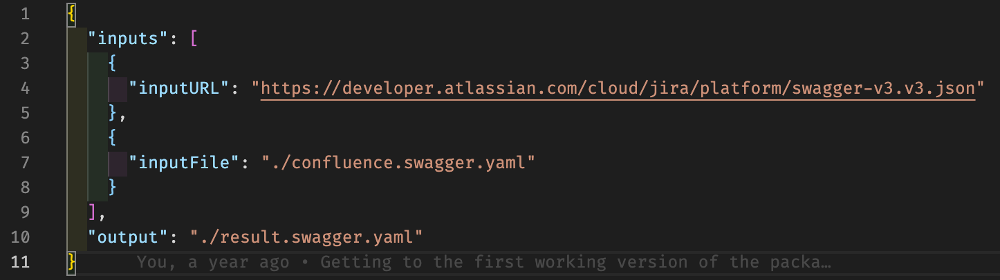

## The openapi-merge repository

### 📖 [Read the full documentation](https://robertmassaioli.github.io/openapi-merge/)

Welcome to the openapi-merge repository. This library is intended to be used for merging multiple OpenAPI 3.0, 3.1 and 3.2 files together. The most common reason that developers want to do this is because they have multiple services that they wish to expose underneath a single API Gateway. Therefore, even though this merging logic is sufficiently generic to be used for most use cases, some of the feature decisions are tailored for that specific use case.

### Screenshots


(An example of creating an openapi-merge.yaml configuration file for the CLI tool)

### About this repository

This is a multi-package repository that contains:

* The openapi-merge library: [](https://bit.ly/2WnIytF) — [`packages/openapi-merge`](packages/openapi-merge)
* The openapi-merge CLI tool: [](https://bit.ly/3bEVq3f) — [`packages/openapi-merge-cli`](packages/openapi-merge-cli)

#### Which package do I want?

* **Use the CLI** ([`openapi-merge-cli`](packages/openapi-merge-cli)) if you have one or more OpenAPI files on disk (or reachable by URL) and want a merged file produced by a config file and a command — no code to write. See the [CLI reference](https://robertmassaioli.github.io/openapi-merge/cli/).
* **Use the library** ([`openapi-merge`](packages/openapi-merge)) if you're merging specs programmatically, e.g. as part of a larger build or gateway-generation tool. The CLI is itself a thin wrapper around this library, so anything the CLI can do, the library can do from your own code. See the [library reference](https://robertmassaioli.github.io/openapi-merge/library/).

Please see the README file of the specific package, or the [documentation site](https://robertmassaioli.github.io/openapi-merge/), for full usage details.

### Developing on openapi-merge

This project is a multi-package repository and uses [Bun][1] workspaces to manage these packages in one development
experience. Packages are compiled with [`tsgo`][2], the Go-based native preview of the TypeScript compiler.

After checking out this repository, you can run the following command to install the required dependencies:

``` shell
bun install
```

You can then test running the CLI tool by running:

``` shell
bun run cli
```

If you wish to ensure that you can develop on the `openapi-merge` library in parallel to the `openapi-merge-cli` tool
then you must run the Typescript build for `openapi-merge` in watch mode. You can do this by:

``` shell
cd packages/openapi-merge && bun run build -- --watch
```

This will ensure that the Typescript is compiled into JavaScript so that it can be used by the `openapi-merge-cli` tool.

Before committing, run the full test suite and lint (eslint + a typecheck of both packages):

``` shell
bun run test
bun run lint
```

`bun run lint` also runs automatically on every `git commit` via a Husky pre-commit hook, so a commit will fail locally rather than in CI if either check doesn't pass.

For the other operations that you wish to perform, please see the package.json of the other packages in this repository.

 [1]: https://bun.sh/
 [2]: https://github.com/microsoft/typescript-go